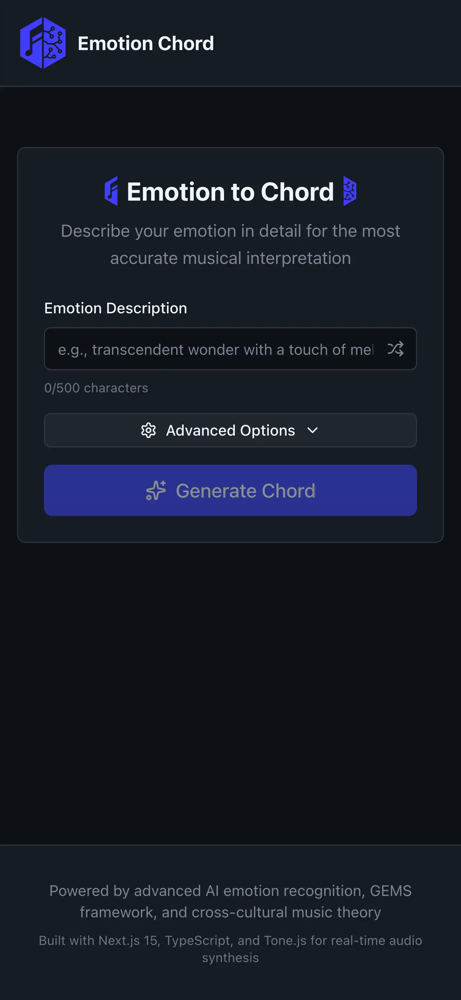
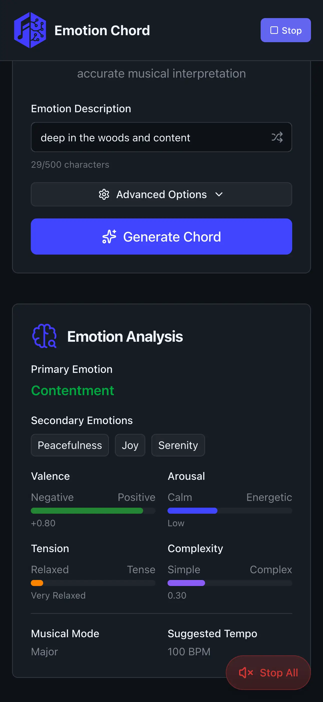

# Emotion Chord

Transform emotions into musical chords using AI-powered analysis, advanced music theory, & real-time audio synthesis!

🚀 &nbsp; [emotion-chord](https://emotion-chord.vercel.app/)

## Overview

Emotion Chord is a full-stack application that analyzes emotional text input and generates corresponding musical chords with sophisticated harmonic progressions. The system combines OpenAI's emotion analysis with music theory principles to create meaningful musical expressions.

## Architecture

**Next.js Application with:**

- Built-in API routes for emotion-to-chord conversion
- OpenAI integration for advanced emotion analysis
- Tone.js audio synthesis for real-time chord playback
- Advanced music theory algorithms

## Features

### 🧠 Emotion Analysis

- Natural language emotion processing via OpenAI
- GEMS framework integration (Geneva Emotional Music Scale)
- Valence, arousal, tension, and complexity mapping

### 🎼 Musical Intelligence

- Advanced chord generation with voice leading
- Multiple voicing types (close, open, drop2, quartal, etc.)
- Harmonic progression analysis with Roman numeral notation
- Cultural musical alternatives (Indian raga, Arabic maqam)

### 🔊 Real-time Audio

- Interactive chord playback with Tone.js
- Arpeggio patterns with emotion-based tempo
- Chord progression sequencing and looping
- Professional audio effects chain (reverb, compression, filtering)

### 🎨 Modern UI

- Next.js 15 + React 19
- Responsive design for all devices
- Real-time chord visualization
- Interactive music theory displays

<p style="display:flex; gap:24px; justify-content:center; flex-wrap:wrap;">
  
  
</p>

## Quick Start

```bash
# Clone repository
git clone git@github.com:colespen/emotion-chord.git
cd emotion-chord

# Install dependencies
pnpm install

# Set up environment variables
cp .env.example .env.local

# Add your OpenAI API key to .env.local
OPENAI_API_KEY=your_openai_api_key_here

# Start development server
pnpm dev
```

**Access:**

- Web App: http://localhost:3000
- API Routes: http://localhost:3000/api/\*

## API Usage

### Generate Chord from Emotion

```bash
POST http://localhost:3000/api/emotion-to-chord
Content-Type: application/json

{
  "emotion": "transcendent wonder with a touch of melancholy",
  "options": {
    "culturalPreference": "western",
    "stylePreference": "contemporary",
    "includeProgression": true,
    "includeCulturalAlternatives": true
  }
}
```

### Response Structure

```json
{
  "emotion": {
    "primaryEmotion": "wonder",
    "valence": 0.3,
    "arousal": 0.7,
    "tension": 0.4,
    "musicalMode": "major",
    "suggestedTempo": 85
  },
  "primaryChord": {
    "symbol": "Cmaj9",
    "notes": ["C", "E", "G", "B", "D"],
    "midiNotes": [60, 64, 67, 71, 74],
    "voicing": { "voicingType": "open", "density": "sparse" },
    "harmonicComplexity": 0.65,
    "emotionalResonance": 0.82
  },
  "chordProgression": {
    "chords": [...],
    "key": "C major",
    "tempo": 85,
    "emotionalJourney": "..."
  },
  "culturalAlternatives": {
    "indian": { "name": "Raga Yaman", "notes": [...] },
    "arabic": { "name": "Maqam Ajam", "notes": [...] }
  }
}
```

## Tech Stack

### Backend (API)

- **Runtime**: Node.js 18+
- **Framework**: Hono (lightweight, fast)
- **AI**: OpenAI GPT-4 for emotion analysis
- **Music Theory**: Tonal.js for chord calculations
- **Validation**: Zod schemas
- **Language**: TypeScript

### Frontend (Web)

- **Framework**: Next.js 15 with React 19
- **Audio**: Tone.js synthesis engine
- **Styling**: Tailwind CSS with GitHub theme
- **Icons**: Lucide React
- **Language**: TypeScript

## Environment Variables

### Application (`.env.local`)

```env
# OpenAI API Key for emotion analysis
OPENAI_API_KEY=your_openai_api_key_here

# Development environment
NODE_ENV=development

# Spotify API credentials (currently mocked)
SPOTIFY_CLIENT_ID=your_spotify_client_id
SPOTIFY_CLIENT_SECRET=your_spotify_client_secret
```

## Development

```bash
# Start the application in development mode
pnpm dev

# Build for production
pnpm build

# Run tests
pnpm test
```

## Deployment

```bash
# Build all apps
pnpm build

# Start production servers
pnpm start
```

## Contributing

1. Fork the repository
2. Create a feature branch: `git checkout -b feature/your-feature`
3. Make your changes and commit: `git commit -am 'Add feature'`
4. Push to the branch: `git push origin feature/your-feature`
5. Submit a pull request

## License

MIT License - see LICENSE file for details.

---

Built with ❤️ and 🎵 using AI-powered emotion analysis and modern web technologies.
